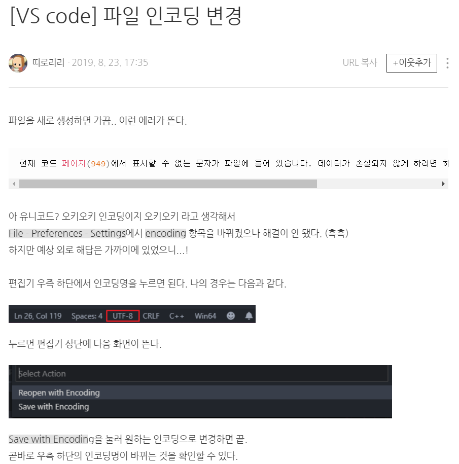

### [meta] charset

####(0).앞서 알아야 할 내용  
.
    1.웹 문서를 작성할때(어떠한 문자인코딩을 설정하여 저장할 것인지)와 브라우저가 웹 페이지를 읽을때(어떠한 문자인코딩을 설정하여 읽을 것인지) 
        각각의 사용한 문자 인코딩이 일치하지 않는경우 문자 깨짐현상이 일어난다. 예를들어, 파일 작성하고 저장할때는, euc-kr인데, meta태그의 charset은
        UTF-8이 된경우 문자 깨짐현상이 나타남, 또한 meta태그로 charset을 지정하지 않은경우에, 브라우저는 기본설정에 따라 알아서 웹 문서를 읽기 때문에, 운 좋게 설정된
        값과 웹 페이지의 문자 인코딩이 같으면 제대로 보이고 아니면 깨져 보이게 되는 것이다.
.
    2.ecu-kr 과 utf-8은 호환성이 없다. 즉, 웹 문서 작성할때, ecu-kr로 설정하여 저장하고, meta태그는 utf-8하면 깨진다.
        그 이유는, ecu-kr과 utf-8은 아예 적용 원리 방식이 다르기 때문이다.(한글2020으로 저장한걸, ppt로 읽으려는 형태)
        ecu-kr은 영어, 특수문자, 한글을 포함하고 utf-8은 영어포함한 전세계 문자(utf-8을 유니코드라고도한다.)를 포함한다.
        [참조링크 : <https://blog.naver.com/terrypark93/221266103970>]   
        [참조링크 : <https://norux.me/31 - EUC-KR과 UTF-8의 원리>]
.
    3.요즘에는 파일 자체가 보통 utf-8로 되어있다. VS code에서는 기본 파일의 문자인코딩 설정이 UTF-8로 되어있으며,
        바꾸는 방법은 아래 사진과 같다. 또한 파일의 설정된 문자인코딩은 VC code로 작성하는경우 우측하단에 적혀있다.
        
        [참조링크 : <https://blog.naver.com/seongeun_tru/221626111454>]
.
    4.utf-8을 쓰던 UTF-8을 쓰던, 상관없는것같지만(네이버,더쿠, 그리고 Do it 책은 모두 소문자 utf-8을 쓴다.
        Do it 35pg에 보듯이, HTML5 표준 명세에서는 태그와 그 태그 안에 사용하는 속성들은 모두 소문자로 사용할 것을
        권장한다고 한다.
        [참고문헌 : 45pg에 utf-8도 소문자임]
.
    5.이렇게 웹 문서의 설정된 문자인코딩과 브라우저가 웹페이지를 읽을때 설정되는 문자인코딩이 맞지않는 문제로 문자깨짐이 일어나는것 외 에도
        텍스트 저장 과정에서 예로 UTF-8로 문서를 저장할 때 문서 저장 과정에서 문제가 생겨 일부 텍스트가 변경되는 경우에도 문자깨짐이 일어날 수
        있다. 또한 문자 자체는 손실 없이 그대로 보존됐으나 읽어들인 컴퓨터에서 해당 문자를 지원하는 글꼴이 없어서 올바르게 보여주지 못하는 경우
        도 있다.
.
    6.html파일의 charset 설정 방법에는 2가지가 있다.
        (1).< meta charset="utf-8"> - 주로 HTML5에서 사용되는 형식        
        (2).< meta http-equiv="Content-Type" content="text/html; charset=utf-8"> - 주로 HTML 4.01에서 사용되는 형식 이였다. ,XHTML에서도 쓰임   
        HTML5에서는 두가지 방법 다 지원하지만, 짧은 버전(1형태)를 사용하는 경우가 많다.
        [참조링크 : <https://ofcourse.kr/html-course/%EC%9D%B8%EC%BD%94%EB%94%A9>]
.
    7.JS파일도 문자인코딩을 어떤방식으로 저장할지 지정해야한다, 또한 html파일처럼 브라우저가 어떤 방식의 문자인코딩을 써서 읽을지도 지정해야한다.(즉, html파일과 동일)
        그러나, VS code에 보면 JS파일은 파일 인코딩 설정이 utf-8로 되어있고, script src로 해당 js파일이 연결된경우 해당 html
        파일의 charset태그로 인한 웹 브라우저의 문자인코딩 설정을 연결된 js파일에도 그대로 적용하여 웹 브라우저가 해석하는 걸로 알고 있다. 또한,
        < script>   
            document.wirte("나는")    
        < /script>   
        와 같이 html파일에 포함되서(src연결아님)사용되어도 똑같이 웹 브라우저가 html파일의 charset 설정된것과 똑같이 해당 script태그에도 적용된다.
        디시인사이드에서는 script에 charset="utf-8"을 쓴 경우가 있는데, 이는 타불라 광고의 외부스크립트 태그로 이 태그의 이용자가 html의 문자인코딩이 utf-8과
        다른경우를 대비해서 쓴것같다.
        +
        아래 링크에도 보면, script의 charset 속성을 넣어서 문자인코딩을 js파일에 설정할 수 있으나, 이는 외부 스크립트 파일과 HTML문서의 인코딩이 서로 다른경우에
        사용한다고 한다. 또한 < script>태그에 src속성을 사용하는 경우에만 charset속성을 사용할 수 있다한다. 이는 HTML4.1의 표준이며, HTML5에서도 변동사항이 없다한다.
        사용법은 < script type="text/javascript" src="path/file.js" charset="utf-8">< /script> 와 같이 쓴다. 추가로 script태그의 charset속성에 기술 된 문자셋은
        HTML파일의 문자인코딩 설정과 상관없이 인식된다 한다.
        [참조링크 : <http://www.w3big.com/ko/tags/att-script-charset.html>]   
        [참조링크 : <http://www.tcpschool.com/html-tag-attrs/script-charset>]   
.        
    8.CSS파일도 문자인코딩을 어떤방식으로 저장할지 지정해야한다., 또한 html파일처럼 브라우저가 어떤 방식의 문자인코딩을 써서 읽을지도 지정해야한다.(즉, html파일과 동일)
        근데 CSS에서 사용하는 이유가 속성값 돋움 같은것과 after content 한글 같은것을 쓸때 해석하기위함이다. 설정방법은 css파일 안에 직접 코드를 적는데, 맨 위 상단에 
        @charset "utf-8"; 를 적는다. 근데 거의 모든 css파일의 맨상단에 이 코드가 적혀져 있다. 그 말은 이는 HTML에서 설정한 charset 문자인코딩 방식을 따라간다기보다(js파일처럼)  
        의무적으로 추가를 해주어야 하는것 같다. 또한, html 파일 내에 내부스타일 시트(< style>,< /style>)로 적은 태그는 @charset "utf-8";는 따로 적지않고(적용도 안되는걸로 안다.),
        html파일 내에 설정한 meta charset설정에 따라 브라우저가 해석하는 것으로 안다. 이 @charset "utf-8"은 CSS2.1 표준에 정의되어 있다.
        [참조링크 : <https://taegon.kim/archives/1271>]   
        [참조링크 : <https://frontdev.tistory.com/77>]
.
####(1).전체태그
.
    < meta charset="~">
.
####(2).기능
.
    문자인코딩을 설정한다.
.  
####(3).위치
.
    인스티즈,더쿠,디시인사이드,디시인사이드 갤러리 모두 pc버전 모바일버전 가리지않고, < head>태그 바로 뒤에 썼다.
.
####(4).타 웹사이트 태그예시    
.
    <meta charset="utf-8"> 모두 동일하다.
.  