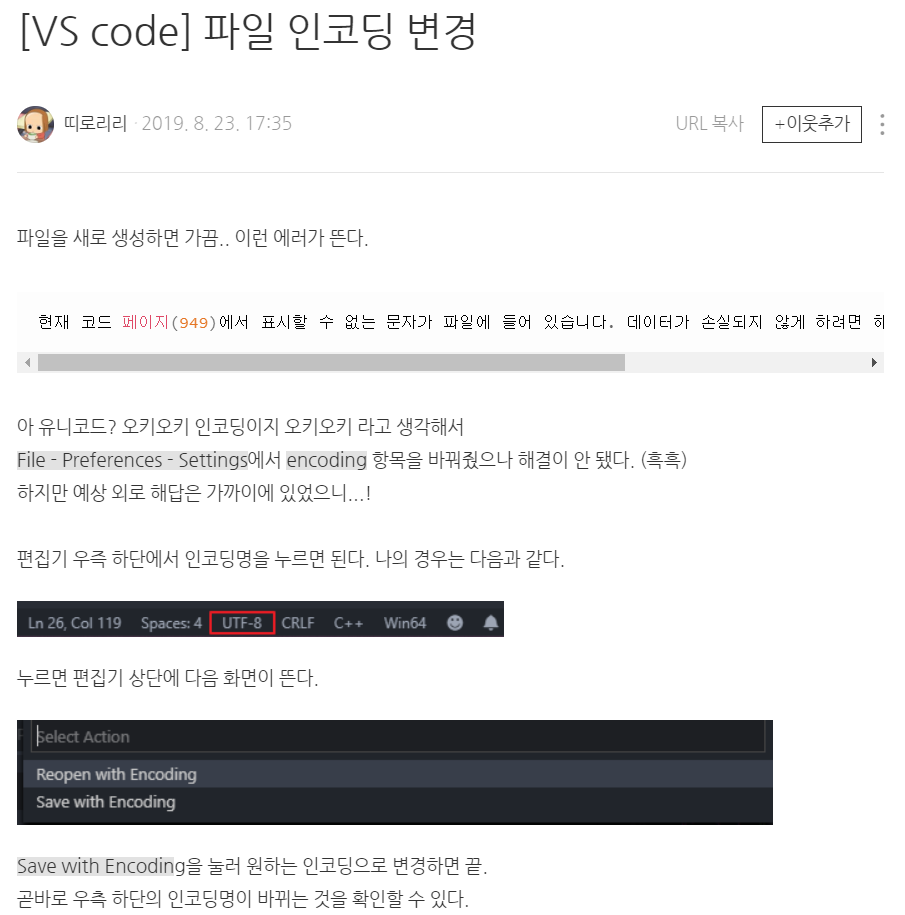

## charset(문자인코딩)의 모든것

### 설명
문자 깨짐을 방지하려면 브라우저에게 웹페이지를 읽을 때 어떤 인코딩을 써야 하는지를 알려줘야
한다. 이를 문 이때 사용하는 것이 <meta> 태그의 charset 속성이다.

### 상세설명
 
#### (1).
"웹 문서를 작성할때"(어떠한 문자인코딩을 설정하여 저장할 것인지) 
와 "브라우저가 웹 페이지를 읽을때"(어떠한 문자인코딩을 설정하여 읽을 것인지) 
각각의 사용한 문자 인코딩이 일치하지 않는경우 문자 깨짐현상이 일어난다. 
[예를들어, 파일 작성하고 저장할때는, euc-kr인데, meta태그의 charset은 UTF-8이 된경우 문자 깨짐현상이 나타남, 또한
meta태그로 charset을 지정하지 않은경우에, 브라우저는 기본설정에 따라 알아서 웹 문서를 읽기 때문에, 운 좋게 설정된
값과 웹 페이지의 문자 인코딩이 같으면 제대로 보이고 아니면 깨져 보이게 되는 것이다.]

#### (2).
ecu-kr 과 utf-8은 호환성이 없다.[즉, 웹 문서 작성할때, ecu-kr로 설정하여 저장하고, meta태그는 utf-8하면 깨진다.]
그 이유는, ecu-kr과 utf-8은 아예 적용 원리 방식이 다르기 때문이다.(한글2020으로 저장한걸, ppt로 읽으려는 형태)
ecu-kr은 영어, 특수문자, 한글을 포함하고 utf-8은 영어포함한 전세계 문자[utf-8을 유니코드라고도한다.]를 포함한다.
[링크 : https://blog.naver.com/terrypark93/221266103970]

*추가로   
1   
 웹서버는 영어를 기본으로 하기 때문에, 웹 문서에서 한글을 표시하려면 한글을 화면에 나타내기
위한 문자 세트를 지정하라는 것은 "문자인코딩"이라고 한다.(DO it Html&CSS 45pg)

2   
추가링크(EUC-KR과 UTF-8의 원리) : https://norux.me/31

#### (3).
요즘에는 파일 자체가 보통 utf-8로 되어있다
VS code에서는 기본 파일의 문자인코딩 설정이 UTF-8로 되어있으며, 바꾸는 방법은 아래 사진과 같다.

[링크 : https://blog.naver.com/seongeun_tru/221626111454]

* 추가링크(유니코드) : https://terms.naver.com/entry.nhn?docId=2270340&cid=51173&categoryId=51173

#### (4).
utf-8을 쓰던 UTF-8을 쓰던, 상관없는것같지만(네이버,더쿠, 그리고 Do it 책은 모두 소문자 utf-8을 쓴다.
But, 고정포워딩 도메인에는 대문자로 씀), Do it 35pg에 보듯이, HTML5 표준 명세에서는 태그와 그 태그 안에
사용하는 속성들은 모두 소문자로 사용할 것을 권장한다.(45pg에 utf-8도 소문자임)

#### (5). - 문자가 깨져 보이는 이유

#####1. 다른 인코딩으로 읽었을 경우

텍스트 작성에 쓰인 문자 인코딩과 텍스트를 열 때의 문자 인코딩이 다른 경우 글자가 깨져서 보일 수 있다
A형식으로 저장된 문자를 B형식으로 해석(인코딩)하려고 하면 문제가 생기는 것(=.hwp 파일을 MS워드에서 열 수 없는 것과 비슷)

->대부분의 경우이다
서로 다른 유니코드 정규화 방식에 따라 한글의 초성/중성/종성이 분리되어 보일 수 있다

#####2. 정보 자체가 손실된 경우
텍스트 저장 과정에서 예로 UTF-8로 문서를 저장할 때 문서 저장 과정에서 문제가 생겨 일부 텍스트가 변경되는 경우
혹은 해당 문자 인코딩이 처리할 수 없는 문자를 넣고 저장한 경우 예로 일본어 문자 해석방법(인코딩)인 상태로 
한국어를 중간에 넣어서 저장할 경우 다른 컴퓨터에서 인코딩(해석)시 문자가 ? 등으로 대체될 수 있다

 
#####3. 문자를 표시해 줄 글꼴이 없는 경우

문자 자체는 손실 없이 그대로 보존됐으나 읽어들인 컴퓨터에서 해당 문자를 지원하는 글꼴/인코딩이 없어서 올바르게 보여주지 못하는 경우

[참고] :“%EC%8A%AC”과 같은 문자가 있는데 주로 웹페이지의 주소(URL)에서 볼 수 있다
      -> “URL인코딩” 또는 “퍼센트 인코딩”이라고 한다
[링크] : https://na27.tistory.com/249

#### (6). - JS파일과 CSS파일 charset 설정
.
      **[1].JS파일 설명**
            1.JS파일도 문자인코딩을 어떤방식으로 저장할지 지정해야함, 또한 html파일처럼 브라우저가 어떤 방식의 문자인코딩을 써서 읽을지도 지정해야함
            (즉, html파일과 동일)
            .   
            .                 
            2.만약 html에 포함된 JS파일의 경우(ex - < script src="~.jf">< script>) JS파일에 charset을 명시하지 않으면, 다음 3가지 경우중 하나이다.(이 부분 나중에 필요할시 확실히 고려해보기)
                {1}. 브라우저가 JS파일을 해석하는 문자인코딩방식은 해당 html파일의 charset을 따라간다.
                {2}. 브라우저에서 기본적으로 그냥 charset utf-8로 해석한다.
                {3}. 그냥 개인 사용자 브라우저 설정된것에 따라 그때마다 다른경우.
                [ {1}의 링크 : https://m.blog.naver.com/PostView.nhn?blogId=miniwikibook&logNo=60176254923&proxyReferer=https%3A%2F%2Fwww.google.com%2F]   
                [ {2}의 링크 : https://zzznara2.tistory.com/109]    
                [ {3}의 링크 : 네이버 웹페이지에서 F12해보면, meta charset utf-8인데도, 또 따로 script에 charset utf-8써놓음]
     .           
            [결론] - html파일이건, js파일이건 utf-8이 이제는 전반적으로 쓰이며, 혹시모르는 {3}의 경우를 고려하여, script파일에도 항상 charset utf-8을 설정하자.
            .   
            .                      
            3.JS파일에 charset명시하는 방법은 < script src="/examples/scripts/script_charset.js" charset="utf-8">< /script>
            와 같이, charset="문자인코딩방식"만 넣어주면된다.(charset="utf-8") [소문자적기 - 네이버도 그럼 + Do it 35pg]
                (단, 1. < script>요소가 외부 스크립트를 참조하는 경우에만 사용할 수 있으며, src 속성이 명시된 경우에만 사용 가능하다.)
            [링크 : http://tcpschool.com/html-tag-attrs/script-charset]
.           .   
            .   
            4.html파일의 문자인코딩설정과 브라우저가 해석하는방식과
            JS파일의 문자인코딩설정과 브라우저가 해석하는방식이 서로 달라도 된다.
            즉, html파일과 JS파일의 방식은 서로 달라도 상관이없다.
            .   
            .   
            5.단, JS파일이 html에 src로 연결되는게 아닌 바로   
            < script>   
                document.wirte("나는")    
            < /script>   
            와 같이 html파일에 포함되서(src연결아님)사용된다면
            이 브라우저의 문자인코딩 방식은 html파일의 charset 속성을 따라간다.
            .   
            .   
        **[2].CSS파일 설명**
            1. CSS파일도 문자인코딩을 어떤방식으로 저장할지 지정해야함, 또한 html파일처럼 브라우저가 어떤 방식의 문자인코딩을 써서 읽을지도 지정해야함
                           (즉, html파일과 동일)
            2. 근데 CSS에서 사용하는 이유가 속성값 돋움 같은것과 after content 한글 같은것을 쓸때 해석하기위함이다.
            3. script는 속성에 charset햇지만 css는 직접 코드 맨 위 상단에 기술한다.
            4. 사용하는 방법은 css파일 맨 위 상단에, @charset "utf-8"; 와 같이 쓴다.
            [링크 : https://taegon.kim/archives/1271]
.   
.    

#### (7). - meta 태그의 위치와 영어문자 해석방식   
.
            1. 영어는 공통적으로 해석하되, 다른 종류의 문자들을 파일의 문자인코딩에 맞게 저장하는것(즉, 영어는 어떤 문자인코딩을 쓰던 허용된다.) [나중에 더 필요할시 보기] 
            2. 따라서, html,css,js의 charset 속성을 설정하는 위치를 알려주려한다.   
                [1].html   
                    보통 < head>의 맨 상단에 meta태그로 charset속성을 쓴다.(다른 한글 문자를 브라우저가 읽기전에) - ex)네이버
                    그러나 theqoo같은데는, 맨상단에 필요한 내용을 넣어야하는경우(단, 한글이나 다른글자가 없어야한다.) 그 다음에 meta charset 쓰더라
                 .   
                 .   
                 [2]. JS
                    < scipt src~>의 태그 안에 쓴다.
                 .   
                 .   
                 [3]. CSS
                    css파일 맨 위 상단에, @charset "utf-8"; 을 쓴다.
.   
.    
.    
.    
### html파일의 charset 설정 방법 : 2가지

1. < meta charset="utf-8"> - 주로 HTML5에서 사용되는 형식        
.   
2. < meta http-equiv="Content-Type" content="text/html; charset=utf-8"> - 주로 HTML 4.01에서 사용되는 형식 이였다. ,XHTML에서도 쓰임   
[링크 : https://ofcourse.kr/html-course/%EC%9D%B8%EC%BD%94%EB%94%A9]

HTML5에서는 두가지 방법 다 지원하지만, 짧은 버전(1형태)를 사용하는 경우가 많다.
(예. 네이버 , 더쿠 등등..)

